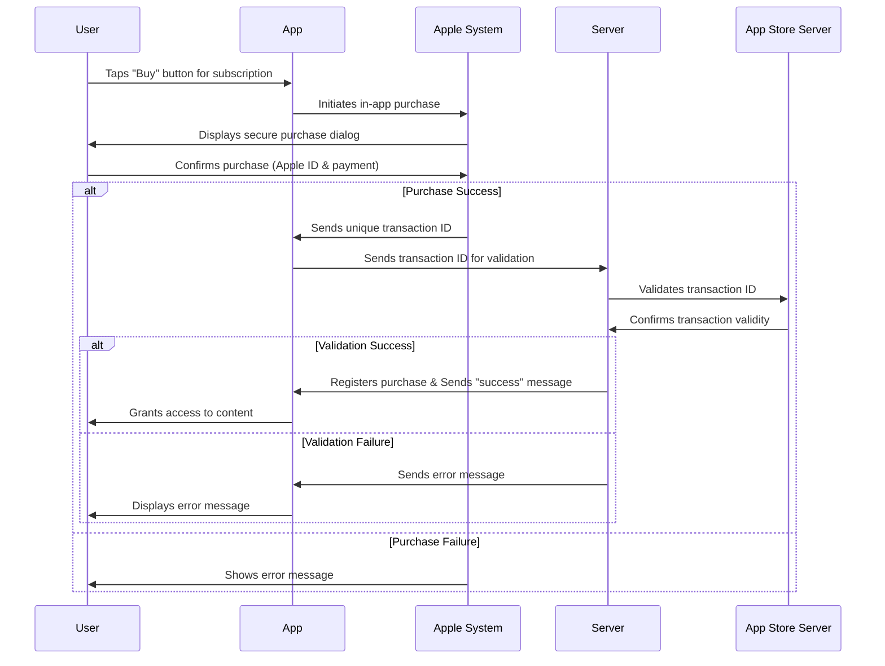
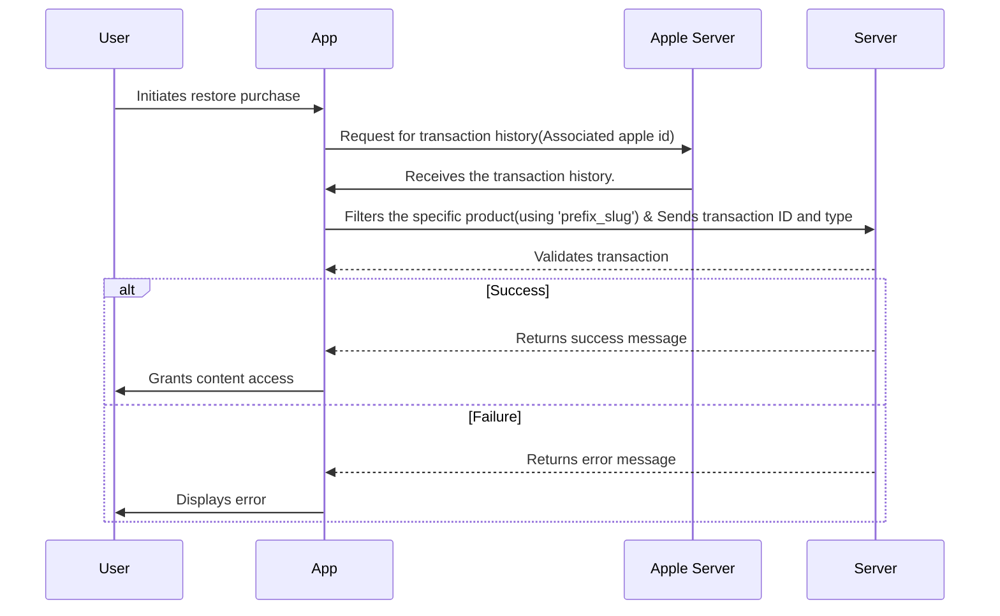

# NETTV  In-app purchase implementation

  
Mobile in-app purchases (IAPs) allow users to purchase digital content or services within a mobile app. Implementing IAPs can be a great way to monetize your mobile app and generate revenue.

There are several types of in-app purchases (IAPs) that mobile app developers can offer to their users. You can find details of these types in following links:

**iOS**:  [https://developer.apple.com/in-app-purchase/](https://developer.apple.com/in-app-purchase/)

The specific types of IAPs that are appropriate for your app will depend on the app's content and business model. For NETTV, we have implemented a non-renewing type for in-app product subscription.
##

### Table of Contents
1. [IOS Setups](https://github.com/alensh12/Docs/blob/master/in_app_purchase_nettv.md#ios-setups)
2. [Flutter Packages for In-App Purchases on iOS](https://github.com/alensh12/Docs/blob/master/in_app_purchase_nettv.md#flutter-packages-for-in-app-purchases-on-ios)
3. [Basic Flow](https://github.com/alensh12/Docs/blob/master/in_app_purchase_nettv.md#basic-flow)
4. [Locally Saved Data for In-App Purchases](https://github.com/alensh12/Docs/blob/master/in_app_purchase_nettv.md#locally-saved-data-for-in-app-purchases)
5. [Restore Purchase](https://github.com/alensh12/Docs/blob/master/in_app_purchase_nettv.md#restore-purchase)
6. [Refund Purchase Process](https://github.com/alensh12/Docs/blob/master/in_app_purchase_nettv.md#refund-purchase-process)
7. [Payment Methods](https://github.com/alensh12/Docs/blob/master/in_app_purchase_nettv.md#payment-methods)
8. [App Store Server Notifications](https://github.com/alensh12/Docs/blob/master/in_app_purchase_nettv.md#app-store-server-notifications)
9. [API's Used](https://github.com/alensh12/Docs/blob/master/in_app_purchase_nettv.md#apis-used)
10. [Product ID and its Naming Convention]()
11. [Setting Price of In-app Subscription](https://github.com/alensh12/Docs/blob/master/in_app_purchase_nettv.md#setting-price-of-in-app-subscription)
12. [Apple's Small Business Program](https://github.com/alensh12/Docs/blob/master/in_app_purchase_nettv.md#apples-small-business-program)


#

### IOS Setups
We need to complete different setups before implementing in app purchase which can be found in documentation below:

[In-App Purchase| Apple Developer Documentation](https://developer.apple.com/in-app-purchase/)

1. [Sign the Paid Applications Agreement and set up your banking and tax information in App Store Connect.](https://developer.apple.com/help/app-store-connect/provide-tax-information/tax-forms-overview)
2. [Generate keys for in-app purchases.](https://developer.apple.com/help/app-store-connect/configure-in-app-purchase-settings/generate-keys-for-in-app-purchases)
3. [Generate a shared secret to verify receipts.](https://developer.apple.com/help/app-store-connect/configure-in-app-purchase-settings/generate-a-shared-secret-to-verify-receipts)
To increase the security between our server and Apple’s server when validating a subscription or in-app purchase, include a shared secret with your request to verify receipts.

4. [Create a subscription in the app store connect.](https://developer.apple.com/help/app-store-connect/manage-in-app-purchases/create-non-renewing-subscriptions/)
5. [Enable in-app purchase in Xcode.](https://developer.apple.com/documentation/xcode/adding-capabilities-to-your-app)
#


### Flutter Packages for In-App Purchases on iOS
To support in-app purchases on iOS, the following Flutter packages are used:

##### Dependencies
- [in_app_purchase^3.2.2](https://pub.dev/packages/in_app_purchase/versions/3.2.2)
> Provides the core functionality for handling in-app purchases across platforms.
##### Dependency Overrides
- [in_app_purchase_storekit^0.4.0](https://pub.dev/packages/in_app_purchase_storekit/versions/0.4.0) 
> Overrides the default in_app_purchase_storekit version used by in_app_purchase: ^3.2.2. This ensures the latest StoreKit implementation is utilized for iOS-specific in-app purchase features.

```Note: The override to in_app_purchase_storekit: ^0.4.0 is necessary because in_app_purchase: ^3.2.2 does not include the most recent version of in_app_purchase_storekit, which defaults to using StoreKit for iOS.```

#
### Important Note
> As of StoreKit2 implementation, In-App Purchase Payment is only available on iOS devices running iOS 15.0 or later.
> Incase of iOS devices below 15.0 , App shows a note message below the payment method.
>
> ```** In-App purchase is only available from iOS 15.0```

##

  
### Basic Flow
1. **User Starts the Purchase**: User makes subscription for product subscriptions and taps the “Buy” button to make an in-app purchase.
    
2.  **Apple Displays Purchase Dialog**: Apple’s system steps in and shows a secure dialog box, asking the user to confirm the subscription purchase. This usually includes signing in with their Apple ID and approving the payment.
    
3.  **Purchase Outcome**: On Success, If the payment goes through, Apple generates a unique transaction ID and sends it to app. On failure,  If something goes wrong Apple shows an error message to the user, and the process stops here.
    
4.  **Server Validation**: App sends the transaction ID to server, which securely checks it with Apple’s App Store server to confirm the purchase is legit.

5. **Final Result**: On success, If Apple’s server verifies the transaction, server registers the purchase. App gets a “success” message, and gets access to content. On failure, If the validation fails (e.g. Due to an invalid transaction ID or some issue), server sends an error message back to the app.




### Locally Saved Data for In-App Purchases
The App stores the ```product_id```, a unique identifier for each product, in the app's preferences to manage in-app purchases.

Below is the process for handling this data:

- Storage Location:
The ```product_id``` is saved in the app's preferences under the key ```in_app_purchase_product_ids``` as part of a product ID list.
- Storage Condition:
The ```product_id``` is only stored locally if the request to sync the purchase with the backend fails.
- Data Removal:
The specific ```product_id``` is removed from the ```in_app_purchase_product_ids``` list once the sync with the backend is successful.
#

##
### Restore Purchase
1. **User Restore purchase**: Incase of syncing failed on backend, User can intiate restore purchase which he/she has already bought in other devices or want to restore in same device.

2. **Communicate Apple Server**: App sends a request to the Apple Server to fetch the transaction history associated with the logged-in Apple ID. The Apple Server processes the request and responds with the complete transaction history for the Apple ID. The App receives the transaction history and filters it using the unique identifier ```prefix_slug``` to identify the specific product to be restored.
   -  For eg. If the slug for that item is ```xyz-123``` app changes it to ```xyz_123```
   -  ```mov``` is ```prefix```, depending upon the type of product ie. `mov` for Movie & `pkg` for Package
   -  ```xyz_123``` is ```slug```
   -  Resulting `mov_xyz_123`

4. **Restore Outcome**: App send "transaction id" and "transaction type" to validate to server.

5. **Final result**: On success, App gets "success message" and gets access to content. On failure, server sends an error message back to app.


##
### Refund Purchase Process
For developers, a specific code implementation is available to test refund functionality.

> Developer Testing (Refund Implementation)
To simulate and verify refund behavior during testing, developers can use the following code:

```dart
IAPMethodCall().requestRefund($transactionId)
```


This method initiates a refund request for a specified transactionId, enabling developers to test refund workflows.

#

### Payment Methods

The app offers three flexible payment methods, allowing users to select their preferred option. These methods can be customized by enabling or disabling them through the configuration [Dynamic Content Config](https://iptv-admin.geniustv.dev.geniussystems.com.np/dynamic-content/edit/230)

#### Available Payment Methods
- Wallet Payment
- Payment Gatewys
- In app purchase

#
	
### App Store Server Notifications
App Store Server Notifications is a server-to-server service that notifies you in real time when the status of in-app purchases and refunds changes. 
- [App Store Server Notification](https://developer.apple.com/documentation/appstoreservernotifications)
- [Server URLs for App Store Server Notifications](https://developer.apple.com/help/app-store-connect/configure-in-app-purchase-settings/enter-server-urls-for-app-store-server-notifications)
- [Responding to App Store Server Notifications](https://developer.apple.com/documentation/appstoreservernotifications/responding-to-app-store-server-notifications)

We have used this mechanism to listen to the status of the user's in-app purchase and perform changes accordingly. For example, when a user refunds a purchase and we get the notification, we cancel the user's subscription from our side.

We can ask App Store Server Notifications to send a test notification to our server.  
[https://developer.apple.com/documentation/appstoreserverapi/request\_a\_test\_notification](https://developer.apple.com/documentation/appstoreserverapi/request_a_test_notification)


  
**Testing in-app purchases(iOS):**

Apple provides a testing environment, called sandbox, which allows you to test in-app purchases without incurring charges, using special test accounts.  
[https://developer.apple.com/documentation/storekit/in-app\_purchase/testing\_in-app\_purchases\_with\_sandbox](https://developer.apple.com/documentation/storekit/in-app_purchase/testing_in-app_purchases_with_sandbox)  
[https://help.apple.com/app-store-connect/\#/dev7e89e149d](https://help.apple.com/app-store-connect/#/dev7e89e149d)
#

### API's Used
 
BASEURL -

> URL : ```https://ott-resources.geniustv.dev.geniussystems.com.np``` (DEV)


PAYMENT METHODS -
> URL : ```BASEURL + public/setting/v1/config/payment-config```

> METHOD : ```GET```


PAYMENT VERIFY -
> URL : ```BASEURL + resellers/$resellerId/subscribers/$subscriberId/serial/$serial/subscriptions/apple/verify```

> METHOD: ```POST```

> AUTHORIZATION HEADER: ```BEARER TOKEN```

> PAYLOAD :

BUY - ```transaction_type : 'purchased'```

RESTORE  - ```transaction_type : 'restored'```

```dart 
{
	"transaction_id": $transactionId,
	"transaction_type":$transactionType
}
```
#

### Product ID and its Naming Convention 
The `product_id` is a unique identifier for each product, used consistently in the app and App Store Connect, and follows a specific naming convention:

> Each product has a distinct `product_id` defined in App Store Connect during creation, which the app uses to identify and retrieve product details.


**Naming Convention**
- Slug Transformation: The product slug `(e.g., xyz-123)` is modified by replacing the hyphen with an underscore `(e.g., xyz_123)`.
- Prefix Assignment: A prefix is added based on product type:
>`mov` for Movie products.

>`pkg` for Package products.
- Final Product ID Format: The `product_id` is formed by combining the prefix and transformed slug (e.g., `mov_xyz_123` for a Movie with slug `xyz_123`).

#

### Setting Price of In-app Subscription
To make a subscription available for purchase within the app, the subscription's pricing must be configured. If the pricing is not set, the corresponding subscription's product will not be available for purchase in the app.

We cannot set custom price for product. There are price tier available from which we have to select. For Nepal, lowest price we can currently set is USD 0.29. So we may not be able to set equivalent price for existing product prices. We can set base country while setting price. "Apple will provide comparable prices for all the other countries or regions based on tax or foreign exchange rates. You can edit prices for individual countries or regions. Apple may automatically adjust prices from time to time in every country or region except your base to account for changes in tax or foreign exchange rates. But Apple wont adjust prices for the countries or region for which you have edited its price."


For more detail :- [Manage in-app purchases](https://developer.apple.com/help/app-store-connect/manage-in-app-purchases/set-a-price-for-an-in-app-purchase/)

#

### Apple's Small Business Program
The [App Store Small Business Program](https://developer.apple.com/app-store/small-business-program/) offers a reduced commission rate of 15% on paid apps and In-App Purchases for developers who earned up to $1 million in proceeds the previous year. Developers must list all Associated Developer Accounts to determine eligibility, which is based on collective proceeds not exceeding $1 million. Enrollment requires being an Account Holder in the Apple Developer Program, accepting the latest Paid Apps agreement, and listing Associated Developer Accounts.

#


