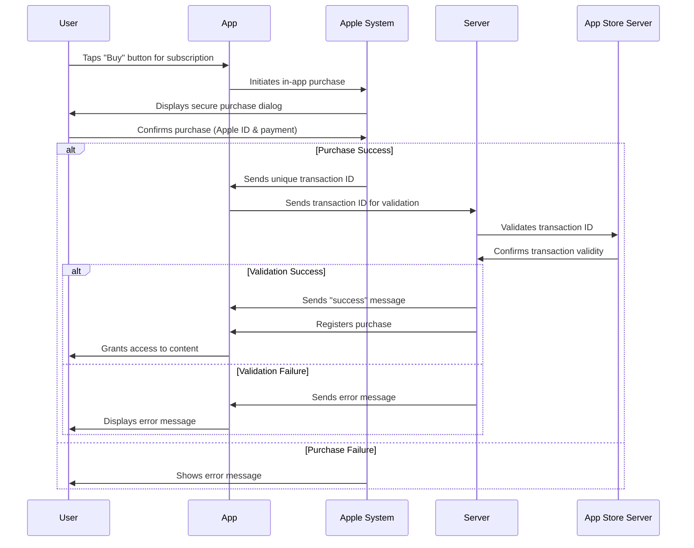
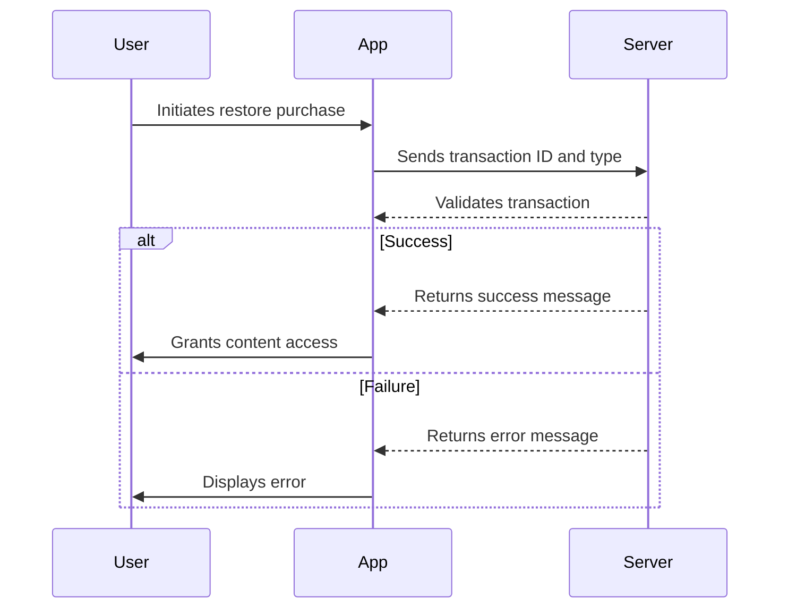

# NETTV  In-app purchase implementation

  
Mobile in-app purchases (IAPs) allow users to purchase digital content or services within a mobile app. Implementing IAPs can be a great way to monetize your mobile app and generate revenue.

There are several types of in-app purchases (IAPs) that mobile app developers can offer to their users. You can find details of these types in following links:

**iOS**:  [https://developer.apple.com/in-app-purchase/](https://developer.apple.com/in-app-purchase/)

The specific types of IAPs that are appropriate for your app will depend on the app's content and business model. For NETTV, we have implemented a non-renewing type for in-app product subscription.
##

  
#### Basic flow :
1. **User Starts the Purchase**: User makes subscription for product subscriptions and taps the “Buy” button to make an in-app purchase.
    
2.  **Apple Displays Purchase Dialog**: Apple’s system steps in and shows a secure dialog box, asking the user to confirm the subscription purchase. This usually includes signing in with their Apple ID and approving the payment.
    
3.  **Purchase Outcome**: On Success, If the payment goes through, Apple generates a unique transaction ID and sends it to app. On failure,  If something goes wrong Apple shows an error message to the user, and the process stops here.
    
4.  **Server Validation**: App sends the transaction ID to server, which securely checks it with Apple’s App Store server to confirm the purchase is legit.

5. **Final Result**: On, Success If Apple’s server verifies the transaction, servers registers the purchase. App gets a “success” message, and gets access to content. On, Failure: If the validation fails (e.g., due to an invalid transaction ID or some issue), server sends an error message back to the app.


##
#### Restore purchase:
1. **User Restore purchase**: User intiate restore purchase which he/she has already bought in other devices or want to restore in same device due to app deletion.

2. **Restore Outcome**: App send "transaction id" and "transaction type" to validate to server.

3. **Final result**: On, Success, App gets "success message" and gets access to content. On Failure: server sends an error message back to app


##
### Refund Purchase Process

Refunds for in-app purchases cannot be initiated within the app. Users must request a refund externally through Apple's refund process, as detailed in [Apple's Refund Support](https://support.apple.com/en-us/118223). For developers, a specific code implementation is available to test refund functionality.

#### Developer Testing (Refund Implementation)
To simulate and verify refund behavior during testing, developers can use the following code:

```dart
IAPMethodCall().requestRefund($transactionId)
```


This method initiates a refund request for a specified transactionId, enabling developers to test refund workflows.
##
### Important Note
*As of StoreKit2 implementation, In-App Purchase Payment is only available on iOS devices running iOS 15.0 or later.*
##

## Payment Methods

The app offers three flexible payment methods, allowing users to select their preferred option. These methods can be customized by enabling or disabling them through the configuration "[Dynamic Content](https://iptv-admin.geniustv.dev.geniussystems.com.np/dynamic-content/edit/230)."

### Available Payment Methods
- Wallet Payment
- E-Payment
- In app purchase

#

### Packages
For implementation, we have use following package to support in app purchase in iOS.

Dependencies
- [in_app_purchase^3.2.2](https://pub.dev/packages/in_app_purchase/versions/3.2.2)

Dependency Overrides
- [in_app_purchase_storekit^0.4.0](https://pub.dev/packages/in_app_purchase_storekit/versions/0.4.0) 

#


### IOS Setups
We need to complete different setups before implementing in app purchase which can be found in documentation below:

[In-App Purchase| Apple Developer Documentation](https://developer.apple.com/in-app-purchase/)

1. [Sign the Paid Applications Agreement and set up your banking and tax information in App Store Connect.](https://developer.apple.com/help/app-store-connect/provide-tax-information/tax-forms-overview)
2. [Generate keys for in-app purchases.](https://developer.apple.com/help/app-store-connect/configure-in-app-purchase-settings/generate-keys-for-in-app-purchases)
3. [Generate a shared secret to verify receipts.](https://developer.apple.com/help/app-store-connect/configure-in-app-purchase-settings/generate-a-shared-secret-to-verify-receipts)
To increase the security between our server and Apple’s servers when validating a subscription or in-app purchase, include a shared secret with your request to verify receipts.

4. [Create a subscription in the app store connect.](https://developer.apple.com/help/app-store-connect/manage-in-app-purchases/create-non-renewing-subscriptions/)
5. [Enable in-app purchase in Xcode.](https://developer.apple.com/documentation/xcode/adding-capabilities-to-your-app)
#
	
### App Store Server Notifications
App Store Server Notifications is a server-to-server service that notifies you in real time when the status of in-app purchases and refunds changes. 
- [App Store Server Notification](https://developer.apple.com/documentation/appstoreservernotifications)
- [Server URLs for App Store Server Notifications](https://developer.apple.com/help/app-store-connect/configure-in-app-purchase-settings/enter-server-urls-for-app-store-server-notifications)
- [Responding to App Store Server Notifications](https://developer.apple.com/documentation/appstoreservernotifications/responding-to-app-store-server-notifications)

We have used this mechanism to listen to the status of the user's in-app purchase and perform changes accordingly. For example, when a user refunds a purchase and we get the notification, we refund the user's subscription from our side.

We can ask App Store Server Notifications to send a test notification to our server.  
[https://developer.apple.com/documentation/appstoreserverapi/request\_a\_test\_notification](https://developer.apple.com/documentation/appstoreserverapi/request_a_test_notification)


  
**Testing in-app purchases(iOS):**

Apple provides a testing environment, called sandbox, which allows you to test in-app purchases without incurring charges, using special test accounts.  
[https://developer.apple.com/documentation/storekit/in-app\_purchase/testing\_in-app\_purchases\_with\_sandbox](https://developer.apple.com/documentation/storekit/in-app_purchase/testing_in-app_purchases_with_sandbox)  
[https://help.apple.com/app-store-connect/\#/dev7e89e149d](https://help.apple.com/app-store-connect/#/dev7e89e149d)
#

### API's Used
 
BASEURL -

> URL : ```https://ott-resources.geniustv.dev.geniussystems.com.np``` (DEV)


PAYMENT METHODS -
> URL : ```BASEURL + public/setting/v1/config/payment-config```

> METHOD : ```GET```


PAYMENT VERIFY -
> URL : ```BASEURL + resellers/$resellerId/subscribers/$subscriberId/serial/$serial/subscriptions/apple/verify```

> METHOD: ```POST```

> AUTHORIZATION HEADER: ```BEARER TOKEN```

> PAYLOAD : 
```dart 
{
	"transaction_id": $transactionId,
	"transaction_type":$transactionType
}
```
#
